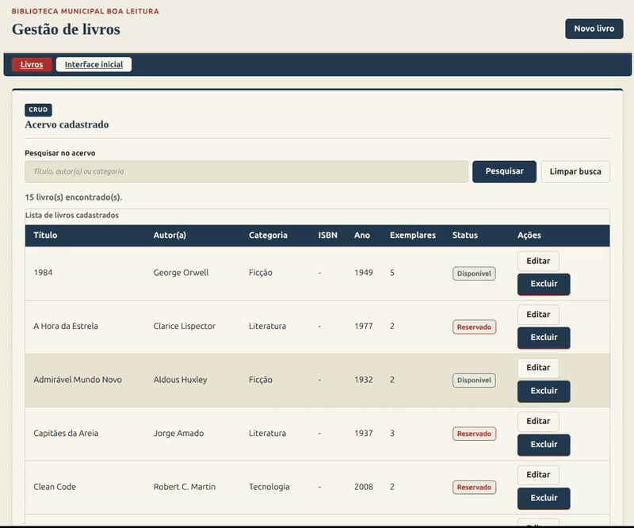

# Sistema de Gestao de Biblioteca

Aplicacao web academica para gestao de biblioteca, organizada em MVC, com CRUD
de livros em Java, Servlets, JSP, JDBC e PostgreSQL.

## Objetivo

Aplicacao web funcional para biblioteca, integrando:

- front-end com HTML, CSS e JavaScript;
- camada Controller para requisicoes e respostas HTTP;
- camada Service para regras de negocio;
- camada DAO/JDBC para acesso ao banco;
- persistencia em PostgreSQL.
- autenticacao por sessao e perfis `ADMIN` e `USUARIO`.

## Tecnologias

- Java 17
- Jakarta Servlet 6
- JSP/JSTL
- JDBC
- PostgreSQL 17.6 no Supabase
- Maven 3.9
- Apache Tomcat 10.1
- mise
- HTML, CSS e JavaScript vanilla
- JUnit 5 e Mockito

## Estrutura MVC

```text
.
|-- pom.xml
|-- mise.toml
|-- .env.example
|-- assets/
|   `-- demo/
|-- database/
|   |-- schema.sql
|   |-- dados-iniciais.sql
|   `-- teste-schema.sql
|-- scripts/
|   |-- executar-local.sh
|   `-- testar-banco.sh
`-- src/
    |-- main/
    |   |-- java/br/com/biblioteca/
    |   |   |-- config/       # configuracao de conexao
    |   |   |-- controller/   # Servlets HTTP
    |   |   |-- dao/          # persistencia com JDBC
    |   |   |-- exception/    # excecoes da aplicacao
    |   |   |-- model/        # entidades do dominio
    |   |   `-- service/      # regras de negocio
    |   `-- webapp/
    |       |-- index.html
    |       |-- css/
    |       |-- js/
    |       `-- WEB-INF/
    |           |-- views/    # JSPs renderizadas pelo Controller
    |           `-- web.xml
    `-- test/
        |-- java/br/com/biblioteca/
        `-- resources/
```

## Funcionalidades atuais

- CRUD de livros no servidor pela rota `/livros`;
- listagem e pesquisa de livros persistidos;
- cadastro, edicao e exclusao com Controller, Service, DAO/JDBC e PostgreSQL;
- mensagens de sucesso/erro via redirecionamento apos operacoes de escrita;
- **Ficha 1: Cadastro**: formulário para registrar um novo livro
  (título, autor(a), categoria, ISBN, ano, exemplares e status), com
  validação nativa do HTML5 e validação complementar em JavaScript
  (mensagens de erro específicas por campo, exibidas em tempo real).
- **Ficha 2: Acervo**: tabela semântica com os livros cadastrados,
  incluindo dados de exemplo, busca por título/autor(a)/categoria e
  contador de resultados.
- **Ficha 3: Leitor**: formulário de cadastro de leitores(as), com
  busca automática de endereço a partir do CEP (requisição assíncrona
  à API pública ViaCEP), sem recarregar a página.
- **Ficha 4: Resumo**: indicadores do acervo total (livros, disponíveis,
  emprestados, reservados, categorias e autores).
- Alternância entre tema claro e tema escuro, com preferência salva no
  navegador.

## Demonstracao visual

A imagem abaixo mostra o fluxo principal do CRUD de livros:



## Arquivos principais

- [pom.xml](pom.xml): configuracao Maven da aplicacao.
- [database/schema.sql](database/schema.sql): script de criacao do banco de dados.
- [database/dados-iniciais.sql](database/dados-iniciais.sql): carga inicial de livros.
- [.env.example](.env.example): exemplo das variaveis de ambiente.
- [scripts/executar-local.sh](scripts/executar-local.sh): execucao local automatizada.
- [scripts/testar-banco.sh](scripts/testar-banco.sh): teste do schema e da persistencia.

## Como executar rapidamente

A forma mais simples de executar localmente e usar o script pronto do projeto:

```bash
./scripts/executar-local.sh
```

Esse comando cria um PostgreSQL temporario, aplica os scripts SQL, gera o WAR,
inicia o Tomcat e publica a aplicacao localmente. O script usado e
[scripts/executar-local.sh](scripts/executar-local.sh).

Depois acesse:

```text
http://localhost:8080/biblioteca/livros
```

Os dados iniciais incluem `admin@boaleitura.local` e `usuario@boaleitura.local`.
Ambos usam a senha local `password`, armazenada no banco exclusivamente como
hash PBKDF2-HMAC-SHA-256. Troque ou remova essas contas antes de publicar.

Para encerrar, pressione `Ctrl+C` no terminal em que o script esta rodando. O
banco temporario e os arquivos temporarios do Tomcat serao removidos
automaticamente.

Pre-requisitos para esse modo:

- Java 17
- Maven 3.9 ou superior
- Apache Tomcat 10.1 com `catalina.sh` no `PATH`
- PostgreSQL 17 com `initdb`, `pg_ctl`, `createdb` e `psql` no `PATH`

## Como executar manualmente

### 1. Pre-requisitos

Instale:

- Java 17
- Maven 3.9 ou superior
- Apache Tomcat 10.1
- PostgreSQL 17, caso queira executar com banco local proprio

Opcionalmente, instale o `mise` para usar as tarefas prontas do projeto.

### 2. Banco de dados

Crie um banco PostgreSQL e execute o script de criacao
[database/schema.sql](database/schema.sql). Em um PostgreSQL local:

```bash
psql -h HOST -U USUARIO_DO_BANCO -d NOME_DO_BANCO -f database/schema.sql
```

Para carregar os dados iniciais de exemplo com
[database/dados-iniciais.sql](database/dados-iniciais.sql):

```bash
psql -h HOST -U USUARIO_DO_BANCO -d NOME_DO_BANCO -f database/dados-iniciais.sql
```

Em uma base existente, não execute novamente o schema completo: aplique
`database/migracoes/001_usuarios_e_seguranca.sql` e cadastre os usuários com
hash PBKDF2-HMAC-SHA-256 gerado pela aplicação.

No Supabase, os mesmos scripts podem ser executados pelo SQL Editor do painel.

Depois configure as variaveis de ambiente usadas pela aplicacao:

```bash
export DB_URL="jdbc:postgresql://HOST:5432/NOME_DO_BANCO"
export DB_USER="USUARIO_DO_BANCO"
export DB_PASSWORD="SENHA_DO_BANCO"
```

Se estiver usando Supabase, utilize os dados do Session Pooler na porta 5432 e
mantenha `sslmode=require` na URL JDBC:

```bash
export DB_URL="jdbc:postgresql://HOST_DO_POOLER:5432/postgres?sslmode=require"
export DB_USER="postgres.REFERENCIA_DO_PROJETO"
export DB_PASSWORD="SUA_SENHA_DO_BANCO"
```

### 3. Executar com Maven e Tomcat

Gere o arquivo WAR:

```bash
mvn package
```

Copie o arquivo gerado para a pasta `webapps` do Tomcat:

```bash
cp target/biblioteca.war "$CATALINA_HOME/webapps/"
```

Inicie o Tomcat:

```bash
"$CATALINA_HOME/bin/catalina.sh" run
```

Acesse:

```text
http://localhost:8080/biblioteca/livros
```

### 4. Executar com mise

Verificar ferramentas:

```bash
mise run versions
```

Executar testes:

```bash
mise run test
```

Executar testes com PostgreSQL local temporario:

```bash
mise run test-db
```

Gerar o arquivo WAR:

```bash
mise run package
```

Rodar a aplicacao localmente com PostgreSQL temporario:

```bash
mise run dev-local
```

A rota principal ficara em:

```text
http://localhost:8080/biblioteca/livros
```

Rodar a aplicacao localmente conectada ao Supabase:

```bash
mise run dev-supabase
```

Essa tarefa exige `.env` configurado na raiz do repositorio. Use
[.env.example](.env.example) como referencia.

## Rotas do CRUD de livros

```text
GET/POST /login
POST     /logout
GET  /livros
GET  /livros/novo
POST /livros
GET  /livros/editar?id={id}
POST /livros/atualizar
POST /livros/excluir
```

## Testes

Executar a suite automatizada:

```bash
mvn test
```

O projeto tambem possui um script para testar o schema e as operacoes principais
em um PostgreSQL local descartavel:

```bash
./scripts/testar-banco.sh
```

O script correspondente, esta em
[scripts/testar-banco.sh](scripts/testar-banco.sh).
